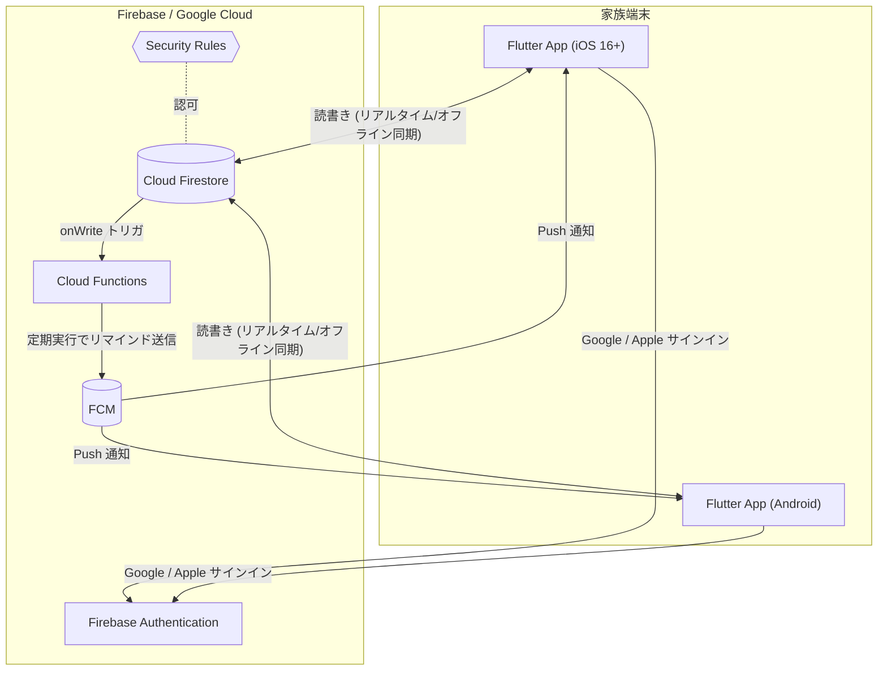
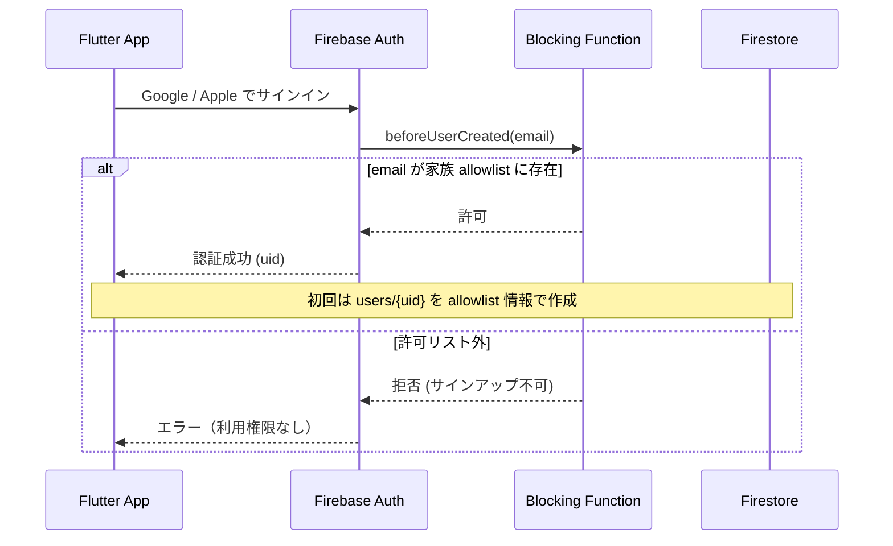
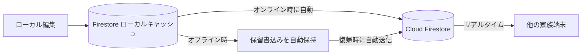
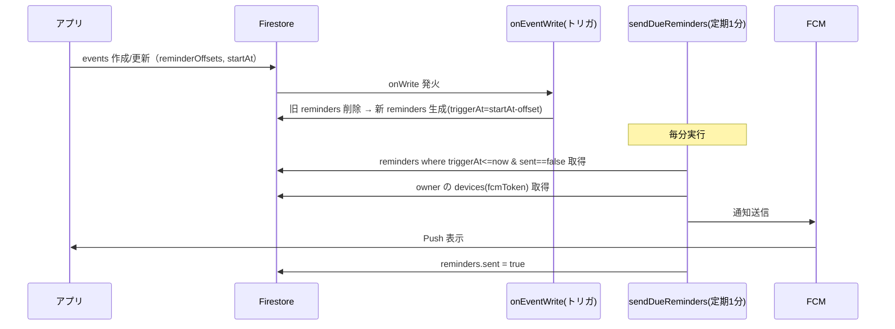

# 基本設計書 — 家庭用スケジュールアプリ（KanSuke）

> 本書は [要件定義.md](要件定義.md) を基に、システムの基本設計（アーキテクチャ／データ／同期／通知／運用）を定める。
> **基盤は Firebase（Google クラウド）を採用**し、サーバ運用を不要にして「IT が得意でない家族でも簡単」を最優先する。

---

## 0. 設計方針サマリ（確定事項）

要件定義 §8「未確定事項」および採用方針の決定。

| # | 項目 | 本設計での決定 |
| --- | --- | --- |
| 1 | サーバ稼働環境 | **Firebase（フルマネージド）に全面移行**。自前サーバ（ラズパイ）は廃止。サーバ運用・VPN・手動バックアップが不要 |
| 2 | 外部到達性 | Firebase はパブリッククラウドのため、**どこからでも到達可能**（VPN 不要） |
| 3 | 認証方式 | **Firebase Authentication + Google / Apple サインイン**。パスワード管理不要。家族メールの allowlist でアクセス制限 |
| 4 | リマインド配信経路 | **Cloud Functions（定期実行）→ FCM**。サーバ送信で確実・複数端末配信に対応 |
| 5 | オフライン対応 | **Firestore のオフライン永続化が標準機能**。閲覧・編集ともに自動キャッシュ＋復帰時自動同期。競合は**フィールド単位 LWW（標準）** |
| 6 | 繰り返し予定 | 本バージョン **対象外**（将来拡張）。データ構造は将来拡張を阻害しない形にとどめる |

### 重要なトレードオフ（要件との差分）

- 要件定義 NFR-5「**自前サーバ・過剰な依存を避ける**」/ §2「データ基盤＝自前サーバ」に対し、本設計は **Google クラウド（Firebase）への依存**を許容する。
- 理由：家族（IT 非専門者を含む）の**運用負荷ゼロ**と**簡単さ**を優先するため。データは Firebase（Google）上に保管される点を関係者で合意の上で採用する。
- → 要件定義 §2 / §7 / §8 の記述は本決定に合わせて更新が必要（本書 §10 参照）。

### 技術スタック

| 層 | 採用技術 |
| --- | --- |
| クライアント | Flutter（iOS 16+ / Android）。状態管理 **Riverpod**、月表示 **table_calendar** |
| 認証 | **Firebase Authentication**（`google_sign_in` / `sign_in_with_apple`） |
| データベース | **Cloud Firestore**（NoSQL、オフライン永続化・リアルタイム同期） |
| アクセス制御 | **Firestore Security Rules** + **Auth Blocking Function**（家族 allowlist） |
| 通知 | **Cloud Functions for Firebase** + **FCM**（`firebase_messaging`） |
| 実行基盤 | Firebase プロジェクト（**Blaze プラン**：従量課金。小規模利用は実質無料枠内の見込み） |
| バックアップ | **Firestore マネージドエクスポート（定期）** + **PITR（Point-in-Time Recovery）** |

---

## 1. システム全体構成



### コンポーネント責務

| コンポーネント | 責務 |
| --- | --- |
| Flutter App | UI、Firestore SDK 経由の読書き（ローカルキャッシュ自動）、認証、FCM 受信・トークン登録 |
| Firebase Authentication | Google / Apple サインイン、家族メンバー判定（Blocking Function 連携） |
| Cloud Firestore | データ永続化（users / events / reminders / devices）、リアルタイム配信、オフライン同期 |
| Security Rules | 家族メンバーのみ読書き可とする認可 |
| Cloud Functions | ①Event 変更時にリマインドを再計算 ②定期実行で配信時刻到達分を FCM 送信 ③新規ユーザーの家族判定・初期化 |
| FCM | iOS/Android へのプッシュ通知 |

### 同期・到達性の前提

- **API サーバは存在しない**。アプリは Firestore SDK で直接読書きし、認可は Security Rules がサーバ側で担保する。
- **オフライン編集・同期は Firestore SDK の標準機能**で完結（自前実装不要）。オフライン中の変更はローカルに保持され、オンライン復帰時に自動送信・反映される。
- 端末は Firebase に対しどこからでも到達可能（VPN 不要）。プッシュ通知も FCM 経由で届く。

---

## 2. 認証・アクセス制御設計

### 2.1 サインインフロー（Google / Apple）



- **Google / Apple サインイン**でパスワード管理を不要にする（要件「簡単さ」）。iOS では Apple サインインを提供。
- Google サインインは任意の Google アカウントが認証可能なため、**家族のみに限定**する仕組みを設ける：
  - **allowlist**：`allowlist/{email}` に家族のメール（＋表示名・色）を管理者が事前登録。
  - **Auth Blocking Function（`beforeUserCreated`）**：サインアップ時にメールを allowlist 照合し、対象外は拒否。
  - 許可された初回サインイン時に `users/{uid}` を allowlist 情報から生成（名前・色を割当）。
- 権限分離は設けず、全メンバー同等権限（要件 §3）。所有者識別は `events.ownerId` で行う。

### 2.2 認可（Security Rules）

家族メンバー（`users/{uid}` が存在する認証ユーザー）のみ読書き可とする。

```javascript
rules_version = '2';
service cloud.firestore {
  match /databases/{db}/documents {
    function isFamily() {
      return request.auth != null
        && exists(/databases/$(db)/documents/users/$(request.auth.uid));
    }

    // 家族メンバー情報（色・名前）は家族全員が閲覧可
    match /users/{uid} {
      allow read: if isFamily();
      allow write: if request.auth.uid == uid; // 自分の情報のみ更新
    }

    // 予定は家族全員が読書き可（全メンバー同等権限）
    match /events/{eventId} {
      allow read, write: if isFamily();
    }

    // リマインド派生データ・デバイスは Functions/本人管理
    match /reminders/{id} { allow read: if isFamily(); }
    match /users/{uid}/devices/{token} {
      allow read, write: if request.auth.uid == uid;
    }
  }
}
```

- 通信は Firebase SDK の **TLS 暗号化**（NFR-4「サーバ通信は暗号化」を満たす）。
- allowlist と Blocking Function により「家族メンバーのみアクセス」（NFR-4）を担保。

---

## 3. データモデル設計（Firestore）

Firestore はドキュメント指向 NoSQL。コレクション/ドキュメントで構成する。

### 3.1 コレクション構成

```
allowlist/{email}                # 家族の許可リスト（管理者が事前投入）
  - name, color

users/{uid}                      # 家族メンバー
  - name, email, color, createdAt, updatedAt
  └ devices/{fcmToken}           # 端末（FCMトークン）
       - platform, updatedAt

events/{eventId}                 # 予定（家族で共有）
  - title, ownerId, participantIds[], startAt, endAt, allDay,
    type, memo, reminderOffsets[], updatedBy,
    createdAt, updatedAt, deleted

reminders/{reminderId}           # 配信用に派生生成（Functionsが管理）
  - eventId, ownerId, triggerAt, sent
```

### 3.2 ドキュメント定義の要点

#### `users/{uid}`
| フィールド | 型 | 説明 |
| --- | --- | --- |
| name | string | 表示名 |
| email | string | サインインメール |
| color | string | 識別色 `#RRGGBB`（FR-2 表示用） |
| createdAt / updatedAt | timestamp | 監査用 |

- `uid` は Firebase Auth の UID。サブコレクション `devices` に FCM トークンを保持。

#### `events/{eventId}`
| フィールド | 型 | 説明 |
| --- | --- | --- |
| id | string | ドキュメント ID（**クライアント生成 UUID**。オフライン作成でも安定） |
| title | string | タイトル |
| ownerId | string | 所有者（`users` の uid）。表示色の判別に用いる。FR-2 |
| participantIds | string[] | 参加者（`users` の uid の配列、任意）。所有者以外に参加する家族メンバー。FR-1 |
| startAt / endAt | timestamp | 開始/終了 |
| allDay | bool | 終日フラグ（true なら時刻は無視） |
| type | string | `tentative`（仮）/ `confirmed`（確定）。FR-3 |
| memo | string | メモ（任意） |
| reminderOffsets | number[] | 「開始 n 分前」の配列（例 `[60, 1440]`）。FR-5 |
| updatedBy | string | 最終更新者 uid |
| createdAt / updatedAt | timestamp | `updatedAt` は `serverTimestamp()` を使用 |
| deleted | bool | **ソフト削除**フラグ（同期で削除を伝播。物理削除は定期パージ） |

- `type` の更新のみで仮↔確定を切替（FR-3「容易に変更」）。
- 月表示は `startAt` の範囲クエリで取得（複合インデックスを定義）。

#### `reminders/{reminderId}`（Functions 管理・派生データ）
| フィールド | 型 | 説明 |
| --- | --- | --- |
| eventId | string | 元 Event |
| ownerId | string | 配信先ユーザー |
| triggerAt | timestamp | 配信時刻 = `startAt - offset分` |
| sent | bool | 送信済みフラグ（多重送信防止） |

- アプリは直接書かない。Event の onWrite トリガで Functions が再生成する（§5）。

---

## 4. データアクセス・同期設計

### 4.1 アクセス方式

- アプリは **Firestore SDK で直接読書き**（中間 API サーバなし）。認可は Security Rules がサーバ側で実施。
- 一覧/カレンダーは **スナップショットリスナ（リアルタイム）** を使用。他端末の変更が即時反映される。

### 4.2 オフライン・同期（標準機能）



- Firestore の**オフライン永続化を有効化**（モバイルは既定 ON）。オフラインでも閲覧・編集が可能で、復帰時に自動同期（NFR-3、要件「編集も許容し後で同期」を**追加実装なしで充足**）。
- **競合解決**：Firestore は**フィールド単位の Last-Write-Wins**（サーバ到達順）。`updatedAt` に `serverTimestamp()` を用いて整合させる。家庭内少人数で競合頻度は低く、標準動作で十分。
- 削除は `deleted=true` の更新として伝播（LWW 対象）。

---

## 5. リマインド通知設計（Cloud Functions + FCM）

### 5.1 構成（2 つの Function）



| Function | トリガ | 役割 |
| --- | --- | --- |
| `onEventWrite` | Firestore `events/{id}` onWrite | Event の `startAt` / `reminderOffsets` / `deleted` を基に `reminders` を再生成（変更時は旧分を破棄し再計算） |
| `sendDueReminders` | スケジュール（毎分） | `triggerAt <= now && sent == false` を抽出し、所有者の全デバイスへ FCM 送信、`sent=true` 化 |

- **配信先**：v1 は所有者の全デバイス。「希望者への配信」は将来の購読モデルで拡張。
- **多重送信防止**：`sent` フラグ。Event 更新で時刻が変われば `onEventWrite` が再生成するため自動で再スケジュール。
- 無効トークン（`messaging/registration-token-not-registered`）は該当 `devices` ドキュメントを削除。

### 5.2 FCM トークン管理

- アプリ起動時にトークン取得 → `users/{uid}/devices/{token}` に upsert。`onTokenRefresh` で更新。

---

## 6. クライアント（Flutter）設計

### 6.1 画面構成

| 画面 | 内容 | 対応要件 |
| --- | --- | --- |
| サインイン | 「Google で続行」/「Apple でサインイン」 | NFR-4 |
| カレンダー（月表示） | `table_calendar`、各日にメンバー色ドット/バー、仮=点線/半透明・確定=実線/塗り | FR-4, FR-2, FR-3 |
| 日別予定一覧 | 選択日の予定リスト（所有者色・種別バッジ） | FR-1, FR-2, FR-3 |
| 予定編集 | タイトル/日時/終日/所有者/参加者（複数選択）/種別（仮↔確定トグル）/メモ/リマインド設定 | FR-1, FR-3, FR-5 |
| 設定 | 自分の色、通知許可、サインアウト | FR-2 |

### 6.2 構成方針

- **Firestore SDK のローカルキャッシュをそのまま利用**（自前ローカル DB 不要 → 構成が単純）。
- **Riverpod** で Firestore のスナップショットストリームをラップし UI へ供給（オフラインファースト）。
- 表示は常にローカルキャッシュ起点 → サーバ未達・オフラインでも閲覧可能（NFR-3）。
- 使用パッケージ：`firebase_core` / `firebase_auth` / `cloud_firestore` / `firebase_messaging` / `google_sign_in` / `sign_in_with_apple` / `table_calendar`。

### 6.3 視覚表現（FR-2 / FR-3）

- 所有者識別：`users.color` を予定バー/ドットに適用。凡例を表示。**表示色の判別は所有者のみで行い、参加者の有無で変えない。**
- 参加者表示：日別予定一覧で参加者名を副次的にテキスト表示し、複数人が関わる予定を把握できるようにする（FR-1）。月表示のマス目は面積が小さいため参加者表示の対象外とする。
- 種別区別：仮＝点線枠・半透明・「仮」バッジ／確定＝実線・塗りつぶし。
- 仮→確定はトグル 1 操作（`type` 更新のみ）。

---

## 7. 非機能設計

| 区分 | 設計 |
| --- | --- |
| パフォーマンス（NFR-1） | Firestore ローカルキャッシュで即時描画。月切替は `startAt` 範囲クエリ（複合インデックス）。リアルタイムリスナで差分のみ受信 |
| 可用性（NFR-3） | Firebase マネージドで高可用。オフライン時もキャッシュで閲覧・編集継続、復帰時自動同期 |
| データ保全（NFR-3） | **Firestore 定期エクスポート**（Cloud Storage バケットへ）＋ **PITR** 有効化。手動運用ほぼ不要 |
| セキュリティ（NFR-4） | TLS 通信、Security Rules による家族限定、allowlist + Blocking Function でサインアップ制限 |
| 保守性（NFR-5） | サーバ・OS・DB の運用が不要。構成は Firebase に集約。Functions と Rules のみ保守対象 |
| コスト | **Blaze プラン（従量）**。小規模家庭利用は Firestore / Functions / FCM の無料枠内に収まる見込み。**予算アラート**を設定し想定外課金を防止 |

---

## 8. 配備・運用設計（Firebase）

### 8.1 プロジェクト構成

```
firebase プロジェクト (Blaze)
├── Authentication        # Google / Apple プロバイダ有効化
├── Firestore             # ネイティブモード、ロケーション選択(asia-northeast1 等)
├── Cloud Functions       # onEventWrite / sendDueReminders / beforeUserCreated
├── Security Rules        # firestore.rules
└── FCM                    # APNs 鍵(iOS) を登録
```

- ソース管理：`firebase.json` / `firestore.rules` / `firestore.indexes.json` / `functions/` をリポジトリ管理。`firebase deploy` で配備。
- iOS は **APNs 認証鍵**を Firebase に登録（FCM→APNs 中継のため）。
- 環境：本番のみで開始可。必要に応じて開発用プロジェクトを分離。

### 8.2 初期セットアップ手順（概要）

1. Firebase プロジェクト作成（Blaze プラン、ロケーション選択）。
2. Authentication で Google / Apple を有効化。iOS は APNs 鍵を登録。
3. `allowlist` に家族のメール・名前・色を投入。
4. Security Rules / インデックス / Functions をデプロイ。
5. Flutter に FlutterFire 設定（`flutterfire configure`）、各プラットフォーム構成ファイルを配置。
6. アプリ配布（iOS：TestFlight もしくは開発証明書での直接配布／Android：APK 配布）。
7. **予算アラート**を設定。

### 8.3 バックアップ・復旧

- Firestore **マネージドエクスポート**を Cloud Scheduler で日次実行 → Cloud Storage バケット保管（世代保持）。
- **PITR** を有効化し、直近期間の任意時点復元を可能にする。

---

## 9. 本バージョンの対象外（将来拡張）

要件 §1.3 / §8 に準拠。

- 予定の追加・変更の **共有通知**（リマインドのみ実装）
- 週/日表示の切替
- 繰り返し予定（毎週・毎月）
- 外部カレンダー連携（Google Calendar 等）
- リマインドの「希望者への配信」購読モデル
- 一般公開・ストア配信・招待機能
- 参加者ごとの個別リマインド配信（v1 は所有者へのリマインドのみ。リマインド配信 Functions 自体が未実装のため #14 実装時に `participantIds` の考慮を申し送る）

---

## 10. 要件定義との差分・更新要否

Firebase 採用により、要件定義の以下を更新する必要がある（要確認）。

| 箇所 | 現状の記述 | 更新方針 |
| --- | --- | --- |
| §2 前提・制約「データ基盤」 | 自前サーバ（NAS / VPS） | **Firebase（マネージド）** に変更 |
| §2「同期」 | 自前サーバ経由 | **Firestore による同期** に変更 |
| §7 想定システム構成 | 自前サーバ（API + DB） | **Firebase 構成図**に差し替え |
| §8 未確定事項 #1〜#4 | サーバ環境/認証/配信/オフライン | 本書で確定済みのため反映 |
| NFR-5 | 過剰な依存を避ける | Firebase 依存を許容する旨を注記 |

---

## 11. 残課題・確認事項

| # | 項目 | 補足 |
| --- | --- | --- |
| 1 | データ保管が Google クラウド | 「家庭内クローズド／自前サーバ」志向との差分を関係者合意（簡単さ優先で採用） |
| 2 | Blaze プランの課金監視 | 無料枠内見込みだが、予算アラート設定で想定外課金を防止 |
| 3 | iOS バックグラウンド同期 | リアルタイムリスナは前面時中心。FCM 通知で更新を促す設計を UX で考慮 |
| 4 | Apple サインインの要件 | iOS で第三者サインイン提供時の Apple サインイン併設（本設計で対応済み） |
| 5 | アプリ配布方法 | iOS：TestFlight or 開発証明書での直接配布（家庭内） |
| 6 | allowlist 運用 | 家族追加時は管理者が allowlist に追記（招待機能は対象外） |
