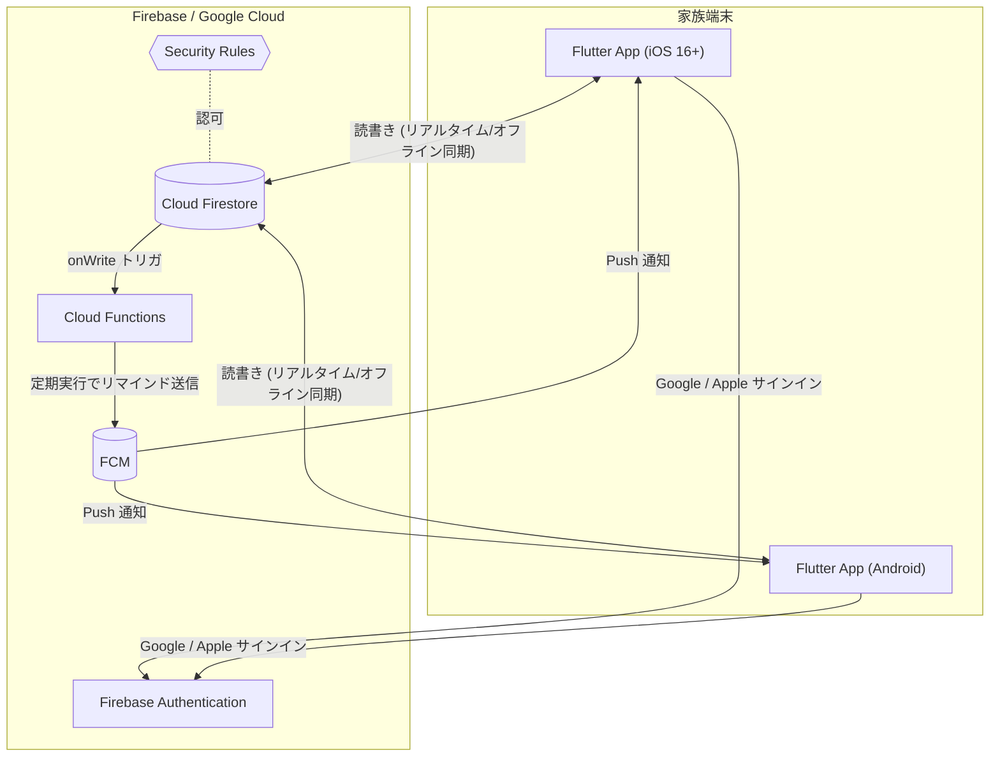
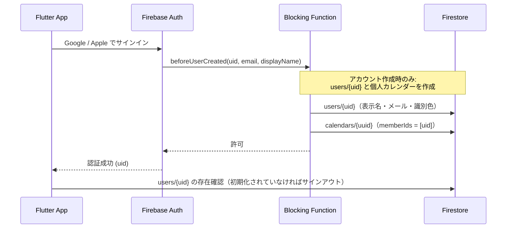
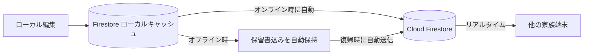
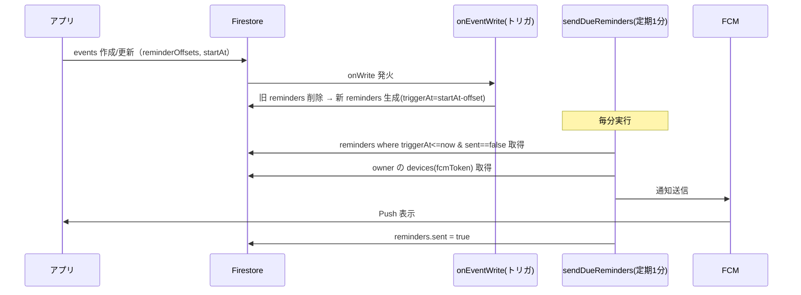

# 基本設計書 — 家庭用スケジュールアプリ（KanSuke）

> 本書は [要件定義.md](要件定義.md) を基に、システムの基本設計（アーキテクチャ／データ／同期／通知／運用）を定める。
> **基盤は Firebase（Google クラウド）を採用**し、サーバ運用を不要にして「IT が得意でない家族でも簡単」を最優先する。

---

## 0. 設計方針サマリ（確定事項）

要件定義 §8「未確定事項」および採用方針の決定。

| # | 項目 | 本設計での決定 |
| --- | --- | --- |
| 1 | サーバ稼働環境 | **Firebase（フルマネージド）に全面移行**。自前サーバ（ラズパイ）は廃止。サーバ運用・VPN・手動バックアップが不要 |
| 2 | 外部到達性 | Firebase はパブリッククラウドのため、**どこからでも到達可能**（VPN 不要） |
| 3 | 認証方式 | **Firebase Authentication + Google / Apple サインイン**。パスワード管理不要。サインアップは制限せず、アクセス制限は Security Rules（カレンダー参加者）で行う |
| 4 | リマインド配信経路 | **Cloud Functions（定期実行）→ FCM**。サーバ送信で確実・複数端末配信に対応 |
| 5 | オフライン対応 | **Firestore のオフライン永続化が標準機能**。閲覧・編集ともに自動キャッシュ＋復帰時自動同期。競合は**フィールド単位 LWW（標準）** |
| 6 | 繰り返し予定 | 本バージョン **対象外**（将来拡張）。データ構造は将来拡張を阻害しない形にとどめる |

### 重要なトレードオフ（要件との差分）

- 要件定義 NFR-5「**自前サーバ・過剰な依存を避ける**」/ §2「データ基盤＝自前サーバ」に対し、本設計は **Google クラウド（Firebase）への依存**を許容する。
- 理由：家族（IT 非専門者を含む）の**運用負荷ゼロ**と**簡単さ**を優先するため。データは Firebase（Google）上に保管される点を関係者で合意の上で採用する。
- → 要件定義 §2 / §7 / §8 の記述は本決定に合わせて更新が必要（本書 §10 参照）。

### 技術スタック

| 層 | 採用技術 |
| --- | --- |
| クライアント | Flutter（iOS 16+ / Android）。状態管理 **Riverpod**、月表示 **table_calendar** |
| 認証 | **Firebase Authentication**（`google_sign_in` / `sign_in_with_apple`） |
| データベース | **Cloud Firestore**（NoSQL、オフライン永続化・リアルタイム同期） |
| アクセス制御 | **Firestore Security Rules**（カレンダー参加者チェック） + **Auth Blocking Function**（アカウント作成時の初期データ生成） |
| 通知 | **Cloud Functions for Firebase** + **FCM**（`firebase_messaging`） |
| 実行基盤 | Firebase プロジェクト（**Blaze プラン**：従量課金。小規模利用は実質無料枠内の見込み） |
| バックアップ | **Firestore マネージドエクスポート（定期）** + **PITR（Point-in-Time Recovery）** |

---

## 1. システム全体構成



### コンポーネント責務

| コンポーネント | 責務 |
| --- | --- |
| Flutter App | UI、Firestore SDK 経由の読書き（ローカルキャッシュ自動）、認証、FCM 受信・トークン登録 |
| Firebase Authentication | Google / Apple サインイン、アカウント作成時の初期化（Blocking Function 連携） |
| Cloud Firestore | データ永続化（users / events / reminders / devices）、リアルタイム配信、オフライン同期 |
| Security Rules | カレンダーの参加者のみ読書き可とする認可 |
| Cloud Functions | ①Event 変更時にリマインドを再計算 ②定期実行で配信時刻到達分を FCM 送信 ③新規ユーザーの初期化（`users/{uid}` と個人カレンダーの生成） |
| FCM | iOS/Android へのプッシュ通知 |

### 同期・到達性の前提

- **API サーバは存在しない**。アプリは Firestore SDK で直接読書きし、認可は Security Rules がサーバ側で担保する。
- **オフライン編集・同期は Firestore SDK の標準機能**で完結（自前実装不要）。オフライン中の変更はローカルに保持され、オンライン復帰時に自動送信・反映される。
- 端末は Firebase に対しどこからでも到達可能（VPN 不要）。プッシュ通知も FCM 経由で届く。

---

## 2. 認証・アクセス制御設計

### 2.1 サインインフロー（Google / Apple）



- **Google / Apple サインイン**でパスワード管理を不要にする（要件「簡単さ」）。iOS では Apple サインインを提供。
- **サインアップは制限しない（家族メールの allowlist は廃止、Issue #87）。** 誰でもサインインできるが、予定はカレンダーの参加者しか読めないため、サインアップしただけの利用者には自分の個人カレンダーしか見えない（アクセス制御は §2.2 の Security Rules に一本化）。
- **Auth Blocking Function（`beforeUserCreated`）** はアカウント作成時に一度だけ発火し、初期データを作る：
  - `users/{uid}`：ID プロバイダの表示名（無ければメールのローカル部）・メール・識別色（uid から決定、本人が設定画面で変更可）。
  - `calendars/{uuid}`：**本人だけが参加する個人カレンダー**（`memberIds = [uid]`、`ownerId = uid`、名前は「〇〇のカレンダー」）。これが最初の表示対象になる（FR-8）。
- クライアントは認証完了後に `users/{uid}` の存在だけを確認し、無ければ初期化失敗としてサインアウトして再試行を促す。
- 予定に対する権限分離は設けず、カレンダー参加者は全員同等に読み書きできる（要件 §3）。予定の表示色判別は `events.participantIds` で行う。カレンダー自体の管理（名前の変更・メンバーの削除・オーナー移譲）だけはオーナーに限る（§2.2、Issue #89）。

### 2.2 認可（Security Rules）

サインアップ済み（`users/{uid}` が存在する認証ユーザー）を前提に、**予定はそのカレンダーの参加者だけ**が読書き可とする（実装は `firestore.rules`）。

```javascript
rules_version = '2';
service cloud.firestore {
  match /databases/{db}/documents {
    function isRegistered() {
      return request.auth != null
        && exists(/databases/$(db)/documents/users/$(request.auth.uid));
    }

    // 予定の可否は、属するカレンダーの memberIds で判定する（FR-8）
    function isCalendarMember(calendarId) {
      return isRegistered() && request.auth.uid in
        get(/databases/$(db)/documents/calendars/$(calendarId)).data.memberIds;
    }

    // ownerId のバックフィル完了までは creatorId をオーナーとみなす（後方互換）
    function calendarOwnerId(data) {
      return ('ownerId' in data) ? data.ownerId : data.creatorId;
    }

    // メンバー情報（色・名前）は個別 get のみ。列挙は禁止（Issue #89）
    match /users/{uid} {
      allow get: if isRegistered();
      allow list: if false;
      allow write: if request.auth.uid == uid; // 自分の情報のみ更新
    }

    // カレンダーは参加者のみ。作成時は自分を参加者に含め、自分がオーナーであること。
    // memberIds / ownerId はクライアントから変更不可（Callable のみ）。
    // 名前の変更はオーナーのみ（Issue #89）
    match /calendars/{calendarId} {
      allow read: if isRegistered()
        && request.auth.uid in resource.data.memberIds;
      allow update: if isRegistered()
        && request.auth.uid in resource.data.memberIds
        && request.resource.data.memberIds == resource.data.memberIds
        && calendarOwnerId(request.resource.data) == calendarOwnerId(resource.data)
        && (request.resource.data.name == resource.data.name
            || request.auth.uid == calendarOwnerId(resource.data));
      allow create: if isRegistered()
        && request.auth.uid in request.resource.data.memberIds
        && request.resource.data.ownerId == request.auth.uid;
    }

    // 招待リンク（FR-9）。クライアントからは read も write も一切許可しない。
    // 発行・確認・受諾・取り消し・一覧は Callable のみ（Issue #90）
    match /invites/{inviteId} { allow read, write: if false; }

    // 予定は calendarId 必須。フォールバックは持たない（Issue #93）
    match /events/{eventId} {
      allow read, update, delete: if isCalendarMember(resource.data.calendarId);
      allow create: if isCalendarMember(request.resource.data.calendarId);
    }

    // リマインド派生データ・デバイスは Functions/本人管理
    match /reminders/{id} { allow read: if isRegistered(); }
    match /users/{uid}/devices/{token} {
      allow read, write: if request.auth.uid == uid;
    }
  }
}
```

- 通信は Firebase SDK の **TLS 暗号化**（NFR-4「サーバ通信は暗号化」を満たす）。
- 「予定はカレンダー参加者のみ」（NFR-4）は Security Rules 単独で担保する。allowlist 廃止後は、サインアップしただけの利用者に見えるのは自分の個人カレンダーだけになる。
- `events` の一覧取得は `calendarId` を実際の `where` 句で絞り込む前提（クエリ全体の証明可能性のため）。
- **`users` は列挙禁止**（Issue #89）。サインアップは開放されている（Issue #87）ため、列挙を許すと第三者が全ユーザーの名前・メール・色を取得できてしまう。クライアントは「自分が参加しているカレンダーの `memberIds`」に含まれる uid だけを個別 get する。

#### 権限モデル（オーナー / メンバー、Issue #89）

`calendars` にオーナー（`ownerId`、1名）を置く。`memberIds` / `ownerId` はクライアントから直接書けず、変更経路は Callable Function（`functions/membership.js`）に限る。

| 操作 | オーナー | メンバー |
| --- | --- | --- |
| 予定の読み書き | ✓ | ✓ |
| メンバーの削除（`removeMember`） | ✓ | ✗ |
| カレンダー名の変更 | ✓ | ✗ |
| 自分の退出（`leaveCalendar`） | ✓（要オーナー移譲） | ✓ |
| オーナー移譲（`transferOwnership`） | ✓ | ✗ |

- `removeMember(calendarId, targetUid)`：オーナーのみ。オーナー自身は指定できない（先に移譲すること）。
- `leaveCalendar(calendarId)`：メンバー本人。オーナーは移譲するまで退出できない。カレンダー削除機能が無いため、最後の1人の退出も当面できない。
- `transferOwnership(calendarId, targetUid)`：オーナーのみ。移譲先はそのカレンダーのメンバーであること。`creatorId`（作成者）は監査用に不変で残す。

#### 招待リンク（FR-9、Issue #90）

`memberIds` がクライアントから書けない以上、カレンダーに家族を追加する唯一の手段が招待リンクになる。`invites` はクライアントから read/write を全面禁止し、すべての操作を Callable Function（`functions/invites.js`、Admin SDK）に限る。トークン本体は保存せず、**SHA-256 ハッシュだけ**を保存する（漏洩時に DB からリンクを復元できないようにする）。

| Callable | 呼べる人 | 役割 |
| --- | --- | --- |
| `createInvite(calendarId)` | そのカレンダーのメンバー | 256bit のランダムトークンを生成し、ハッシュを保存してトークン本体を返す（有効期限24時間・使用回数1回） |
| `previewInvite(token)` | サインイン済みの誰でも | 受諾前の確認。未参加者は `calendars` / `users` を read できないため、**カレンダー名と招待者名**はこの経路でのみ得られる |
| `acceptInvite(token)` | サインイン済みの誰でも | トークンを検証し `memberIds` に追加、`usedCount` を加算。既にメンバーなら成功扱い（冪等、使用回数は増やさない） |
| `revokeInvite(inviteId)` | 発行者本人・オーナー | `revoked = true` にする |
| `listInvites(calendarId)` | そのカレンダーのメンバー | 発行済みリンクの一覧（取り消し導線用。トークンのハッシュは返さない） |

- 無効なリンクは `details.reason`（`not-found` / `expired` / `revoked` / `used`）を添えて返し、アプリが理由を表示する。
- **メールアドレスによる招待は採用しない**（要件 FR-9）。`sign_in_with_apple` の「メールを非公開」で relay アドレスが返るため、メールとサインイン済みアカウントを突き合わせられないケースが構造的に生じる。
- リンクの受け口はカスタムスキーム `kansuke://invite?token=...`（Web は `?token=...`）。家庭内配布のため、ドメイン所有権の検証が要る Universal Links / App Links は使わない。
- **Web ではカスタムスキームのリンクをブラウザから開けない**（Hosting も未設定のため配れる `https` の URL が無い）。そのため、受け取ったリンクを**貼り付けて参加する導線**（カレンダー管理 →「招待リンクで参加」）を全プラットフォームで用意し、これを Web での受け口とする。リンクが開けないメッセージアプリ経由で受け取った場合の回避策も兼ねる。

### 2.3 アカウント削除（退会、Issue #102）

Google Play / App Store は、アカウント作成機能を持つアプリに**アプリ内からの削除導線**を求める。設定画面から本人がアカウントを削除できるようにし、削除処理は Callable Function `deleteaccount`（`functions/deleteaccount.js`、Admin SDK）に一本化する。Auth ユーザーの削除・他人のカレンダーの更新・関連データの整理は Security Rules だけでは行えないため、クライアントから直接 Auth の `delete()` は呼ばない。削除対象は常に呼び出し元本人（`request.auth.uid`。`data` で他人の uid を渡されても無視する）。

**クライアント側の手順（設定画面）**: 二段確認 → 再認証（Google / Apple の再サインイン。誤操作・端末の乗っ取り対策）→ `deleteaccount` 実行 → サインアウトしてログイン画面へ戻す。

**`deleteaccount` の削除対象データ**:

| 対象 | 扱い |
| --- | --- |
| Firebase Authentication のユーザー | 削除（**最後**に実行。途中で失敗しても再実行で続きから片付く冪等な順序） |
| `users/{uid}` / `users/{uid}/devices/*` | 削除 |
| 本人のみが参加するカレンダー | カレンダー本体・配下の `events`・カレンダー宛の `invites` ごと削除 |
| 他メンバーがいる共有カレンダー（本人がメンバー） | `memberIds` から本人を除外（＝退出）。カレンダーと予定は残す |
| 他メンバーがいる共有カレンダー（本人がオーナー） | 本人以外の**先頭メンバー**へオーナーを自動移譲してから退出する（オーナー不在を作らない） |
| 共有カレンダー上の予定 | 残す（他メンバーの表示を壊さないため） |
| 本人が発行した招待（`invites.invitedBy == uid`） | 削除 |
| 本人が設定したリマインド（`reminders.ownerId == uid`、個人・共有問わず） | 削除（`reminders` に `calendarId` は無いため発行者で引く。個人カレンダー分と、共有予定に本人が付けた分の両方が片付く） |

- 削除は**即時**（猶予期間・復旧余地は設けない）。メールでの削除依頼を受けた場合も同じ処理を使う。
- **退会済みメンバーの表示フォールバック**: 共有カレンダーの予定には削除済み uid が参加者として残る。クライアントは `users/{uid}` を引けない参加者を「退会したメンバー」（識別色はグレー）にフォールバックし、予定一覧・月表示（FR-2 の参加者表示）が壊れないようにする。

---

## 3. データモデル設計（Firestore）

Firestore はドキュメント指向 NoSQL。コレクション/ドキュメントで構成する。

### 3.1 コレクション構成

```
users/{uid}                      # サインアップ済みの利用者
  - name, email, color, createdAt, updatedAt
  └ devices/{fcmToken}           # 端末（FCMトークン）
       - platform, updatedAt

calendars/{calendarId}            # カレンダー（FR-8）。ID は UUID
  - name, memberIds[], creatorId, ownerId, createdAt, updatedAt

invites/{inviteId}               # 招待リンク（FR-9）。クライアントからは read/write 全面禁止
  - calendarId, tokenHash, invitedBy, expiresAt, maxUses, usedCount, revoked,
    createdAt, updatedAt

events/{eventId}                 # 予定（属するカレンダーの参加者のみ読書き可）
  - title, creatorId, participantIds[], calendarId, startAt, endAt, allDay,
    type, memo, reminderOffsets{uid: [分]}, updatedBy,
    createdAt, updatedAt, deleted

reminders/{reminderId}           # 配信用に派生生成（Functionsが管理）
  - eventId, ownerId, triggerAt, sent

meta/release                     # 最新リリース（FR-7）。起動時のお知らせ用。CI が上書き
  - version, notes, publishedAt

releases/{version}               # 更新履歴（FR-7）。ID はバージョン文字列。CI が追記
  - version, notes, publishedAt
```

### 3.2 ドキュメント定義の要点

#### `users/{uid}`
| フィールド | 型 | 説明 |
| --- | --- | --- |
| name | string | 表示名 |
| email | string | サインインメール |
| color | string | 識別色 `#RRGGBB`（FR-2 表示用） |
| createdAt / updatedAt | timestamp | 監査用 |

- `uid` は Firebase Auth の UID。サブコレクション `devices` に FCM トークンを保持。

#### `calendars/{calendarId}`（FR-8）
| フィールド | 型 | 説明 |
| --- | --- | --- |
| id | string | ドキュメント ID。**UUID**（アプリ側の作成はクライアント生成、個人カレンダーは Blocking Function が生成）。特別扱いされる固定 ID は存在しない（旧・既定カレンダー `'default'` は UUID へ移行済み、§8.4 参照） |
| name | string | カレンダー名 |
| memberIds | string[] | 参加者（`users` の uid の配列、**1人以上必須**）。このカレンダーの予定を閲覧・編集できる範囲。**クライアントからは書き換え不可**（変更は Callable Function のみ、Issue #89） |
| creatorId | string | 作成者（`users` の uid）。監査用に**不変** |
| ownerId | string | オーナー（`users` の uid、1名）。名前の変更・メンバーの削除・オーナー移譲ができる唯一のメンバー。**クライアントからは書き換え不可**（Issue #89）。作成時は `creatorId` と同一。導入前のドキュメントには存在しないため、**欠損時は `creatorId` をオーナーとして扱う**（バックフィルスクリプトで補完、§8.5 参照） |
| createdAt / updatedAt | timestamp | 監査用 |

- **個人カレンダー**（`memberIds` が本人のみ）は、アカウント作成時に Auth Blocking Function が生成する（§2.1）。本人が `creatorId` かつ `ownerId` になる。これが最初の表示対象になる。
- 表示対象カレンダーの既定は「自分が参加しているカレンダーの先頭（名前昇順）」。ユーザーの選択はアプリ内で保持し、参加していないカレンダーが選ばれている場合は先頭へフォールバックする。
- Security Rules 上、カレンダーは `memberIds` に自分が含まれる場合のみ read 可・名前の変更はオーナーのみ（旧・既定カレンダーへの特例参加は廃止、Issue #87）。オーナー / メンバーの権限モデルは §2.2 を参照。

#### `invites/{inviteId}`（FR-9、Issue #90）
| フィールド | 型 | 説明 |
| --- | --- | --- |
| id | string | ドキュメント ID（Firestore の自動 ID。Admin SDK が採番） |
| calendarId | string | 招待先のカレンダー（`calendars` の id） |
| tokenHash | string | 招待トークンの **SHA-256 ハッシュ（hex）**。トークン本体（256bit のランダム値）は保存せず、発行時の戻り値でのみ返す |
| invitedBy | string | 発行者（`users` の uid）。取り消し権限の判定に使う |
| expiresAt | timestamp | 有効期限（既定: 発行から24時間） |
| maxUses | number | 使用回数の上限（既定 1） |
| usedCount | number | 受諾された回数。既にメンバーの受諾では増やさない（冪等） |
| revoked | bool | 取り消し済みフラグ（発行者本人・オーナーが立てる） |
| createdAt / updatedAt | timestamp | 監査用 |

- **クライアントからは read も write もできない**（`firestore.rules`）。発行・確認・受諾・取り消し・一覧はすべて Callable Function 経由（§2.2）。
- 検索はトークンのハッシュ完全一致（`where('tokenHash','==',…)`）と `calendarId` 完全一致のみで、単一フィールドの既定インデックスで足りる（複合インデックスは追加しない）。

#### `events/{eventId}`
| フィールド | 型 | 説明 |
| --- | --- | --- |
| id | string | ドキュメント ID（**クライアント生成 UUID**。オフライン作成でも安定） |
| title | string | タイトル |
| creatorId | string | 作成者（`users` の uid）。記録用データのみで、表示色の判別には用いない。 |
| calendarId | string | 属するカレンダー（`calendars` の id、**必須**）。読書き可否はこのカレンダーの `memberIds` で判定する（FR-8）。全ドキュメントに実在し、**欠損したドキュメントは読み書きできない**（Security Rules・モデルともフォールバックを持たない、§8.4 参照） |
| participantIds | string[] | 参加者（`users` の uid の配列、**1人以上必須**、`calendarId` が指すカレンダーの `memberIds` に含まれるメンバーに限定）。誰の予定かを表し、表示色の判別に用いる。FR-1 / FR-2 |
| startAt / endAt | timestamp | 開始/終了 |
| allDay | bool | 終日フラグ（true なら時刻は無視） |
| type | string | `tentative`（仮）/ `confirmed`（確定）。FR-3 |
| memo | string | メモ（任意） |
| reminderOffsets | map<uid, number[]> | リマインドの「開始 n 分前」を**設定した本人の uid ごと**に持つ（例 `{papa: [60], mama: [1440]}`）。通知は設定した本人にだけ届き、各自が自分の分だけを設定・変更する（他メンバーの設定は編集時も温存）。FR-5 / Issue #14。導入前の旧形式（予定で共有する `number[]`）は移行せず「設定なし」として読み捨てる |
| updatedBy | string | 最終更新者 uid |
| createdAt / updatedAt | timestamp | `updatedAt` は `serverTimestamp()` を使用 |
| deleted | bool | **ソフト削除**フラグ（同期で削除を伝播。物理削除は定期パージ） |

- `type` の更新のみで仮↔確定を切替（FR-3「容易に変更」）。
- 月表示は `deleted` / `calendarId` の一致 ＋ `startAt` の範囲クエリで取得する（複合インデックス
  `(deleted, calendarId, startAt, endAt)` を定義）。`calendarId` は必ず実際の `where` 句として
  絞り込む。Firestore Security Rules は複数件取得クエリに対し「クエリの `where` 句だけで
  ルール適合を静的に証明できない場合はクエリ全体を拒否する」ため、絞り込まずに取得すると
  他カレンダーの予定が1件でも期間内にあった時点でクエリ全体が失敗する（FR-8）。

#### `reminders/{reminderId}`（Functions 管理・派生データ）
| フィールド | 型 | 説明 |
| --- | --- | --- |
| eventId | string | 元 Event |
| ownerId | string | 配信先ユーザー（= `events.reminderOffsets` にその offset を設定した本人） |
| triggerAt | timestamp | 配信時刻 = `startAt - offset分` |
| sent | bool | 送信済みフラグ（多重送信防止） |

- アプリは直接書かない。Event の onWrite トリガで Functions が再生成する（§5）。
- `events.reminderOffsets` の uid × offset の数だけ生成する。配信時刻が生成時点で既に
  過ぎている分は作らない（作ると次の `sendDueReminders` が「過ぎた予定」を即通知するため）。

#### `meta/release` / `releases/{version}`（FR-7、Issue #96）
| フィールド | 型 | 説明 |
| --- | --- | --- |
| version | string | バージョン（`pubspec.yaml` の `version`。例 `1.3.0`）。`releases` ではドキュメント ID も同じ値 |
| notes | string | リリースノート（`CHANGELOG.md` の当該セクション） |
| publishedAt | timestamp | 公開日時。`releases` では初回書き込み時の値を保つ（過去分は CHANGELOG の日付） |

- リリース時に CI（`main` への push → `.github/workflows/publish-release-version.yml`）が
  Admin SDK で書き込む。**クライアントからは read のみ**（`firestore.rules`）。
- `meta/release` は**最新 1 件**。起動時に端末のバージョンより新しければお知らせダイアログを出す。
- `releases/{version}` は**全バージョンの履歴**。設定画面の「更新履歴」で新しい順に表示する。
  ドキュメント ID がバージョンのため、同じバージョンを再度 publish しても重複しない。
  並べ替えは文字列順では誤る（`"1.10.0" < "1.9.0"`）ため、クライアント側で数値比較する。

---

## 4. データアクセス・同期設計

### 4.1 アクセス方式

- アプリは **Firestore SDK で直接読書き**（中間 API サーバなし）。認可は Security Rules がサーバ側で実施。
- 一覧/カレンダーは **スナップショットリスナ（リアルタイム）** を使用。他端末の変更が即時反映される。

### 4.2 オフライン・同期（標準機能）



- Firestore の**オフライン永続化を有効化**（モバイルは既定 ON）。オフラインでも閲覧・編集が可能で、復帰時に自動同期（NFR-3、要件「編集も許容し後で同期」を**追加実装なしで充足**）。
- **競合解決**：Firestore は**フィールド単位の Last-Write-Wins**（サーバ到達順）。`updatedAt` に `serverTimestamp()` を用いて整合させる。家庭内少人数で競合頻度は低く、標準動作で十分。
- 削除は `deleted=true` の更新として伝播（LWW 対象）。

### 4.3 外部向け読み取り専用 REST API（Issue #103）

アプリ以外（自分用スクリプト・GAS・Home Assistant・MCP サーバー等）から予定を参照するための
HTTP API。**詳細な仕様は [api.md](api.md) を正とする**。ここには設計上の決定だけを記す。

- **形態**: Cloud Functions v2 の `onRequest` 1 関数（`api`）にまとめ、パスでルーティングする
  （`functions/api/`）。v1 は **`GET` のみの読み取り専用**。書き込み・カレンダー管理は対象外。
- **認証**: `Authorization: Bearer <Firebase ID トークン>` を Admin SDK の `verifyIdToken()` で
  検証する。利用者は KanSuke のユーザー本人に限られるため、API キー発行や OAuth2 は導入しない。
- **認可**: この API は Admin SDK で読むため **Security Rules を経由しない**。したがって
  「呼び出し元 uid が対象カレンダーの `memberIds` に含まれること」を API 側の共通関門で必ず検証する
  （FR-8）。ここが漏れると全データが露出するため、カレンダー・予定の取得は例外なくこの関門を通す。
- **存在の秘匿**: 「存在しない」と「自分がメンバーでない」を区別せず、どちらも 404 で返す。
- **境界での変換**: 時刻は API 境界で Firestore の `Timestamp` ↔ ISO 8601（UTC）へ変換する。
  内部管理用の `deleted` / `updatedBy` は外部に出さず、`deleted == true` の予定自体を返さない。
- **繰り返し予定**: v1 は展開せず、マスタのドキュメントを規則（`recurrenceFrequency` /
  `recurrenceCount`）付きでそのまま返す。発生日単位の展開と ICS 配信は後続 Issue。
- **クエリ**: `events` は `deleted` / `calendarId` の一致 ＋ `startAt` の範囲で取得し、既存の複合
  インデックス `(deleted, calendarId, startAt)` を使う（§3.2 の月表示と同じ形。追加は不要）。
  ページングは最後に返した予定の ID を包んだ**不透明カーソル**（`startAfter`）で行う。
- **濫用対策**: 許可オリジンのみの CORS と、uid 単位の簡易レートリミット（インスタンス内の
  ベストエフォート）。
- **公開経路**: 外部に見せる URL は Cloudflare Worker（`cloudflare/api-proxy/`）の
  `https://api.dreamyard.cc` 1 本に絞り、Cloud Functions の URL とプロジェクト ID を表に出さない。
  ただし隠蔽だけでは直アクセスが残るため、Worker が付与する共有シークレット
  （`API_PROXY_KEY`）を Functions 側で検証し、一致しないリクエストは 404 で落とす。
  鍵は Secret Manager / Worker Secrets に置き、リポジトリには入れない。
- **ドキュメント**: `docs/api.md` を正本とし、`docs-site/` が静的 HTML へ変換して
  Cloudflare Pages で公開する（`docs.dreamyard.cc`）。仕様が公開されても、API 自体は
  ID トークンが無ければ何も返さない。

---

## 5. リマインド通知設計（Cloud Functions + FCM）

### 5.1 構成（2 つの Function）



| Function | トリガ | 役割 |
| --- | --- | --- |
| `onEventWrite` | Firestore `events/{id}` onWrite | Event の `startAt` / `reminderOffsets` / `deleted` を基に `reminders` を再生成（変更時は旧分を破棄し再計算） |
| `sendDueReminders` | スケジュール（毎分） | `triggerAt <= now && sent == false` を抽出し、配信先の全デバイスへ FCM 送信、`sent=true` 化 |

- **配信先**：リマインドを設定した本人の全デバイス（`reminders.ownerId` = `events.reminderOffsets` のキー）。各自が自分の分だけを設定するため、参加者でも設定していなければ届かない。「希望者への配信」は将来の購読モデルで拡張。
- **多重送信防止**：`sent` フラグ。Event 更新で時刻が変われば `onEventWrite` が再生成するため自動で再スケジュール。逆に、タイトル・メモなど `startAt` / `reminderOffsets` / `deleted` 以外だけの更新では再生成しない（送信済みの reminder が未送信として作り直され、多重送信になるため）。
- 無効トークン（`messaging/registration-token-not-registered`）は該当 `devices` ドキュメントを削除。

### 5.2 FCM トークン管理

- アプリ起動時にトークン取得 → `users/{uid}/devices/{token}` に upsert。`onTokenRefresh` で更新。

---

## 6. クライアント（Flutter）設計

### 6.1 画面構成

| 画面 | 内容 | 対応要件 |
| --- | --- | --- |
| サインイン | 「Google で続行」/「Apple でサインイン」 | NFR-4 |
| カレンダー（月表示） | `table_calendar`、各日にメンバー色ドット/バー、仮=点線/半透明・確定=実線/塗り | FR-4, FR-2, FR-3 |
| 日別予定一覧 | 選択日の予定リスト（参加者の色・種別バッジ） | FR-1, FR-2, FR-3 |
| 予定編集 | タイトル/日時/終日/参加者（複数選択・必須）/種別（仮↔確定トグル）/メモ/リマインド設定。既存予定を別日へ複製する「コピー」操作（コピー先の複数日をカレンダーで選択し一括複製、繰り返しは引き継がず単発化） | FR-1, FR-3, FR-5 |
| カレンダー編集 | カレンダー名（オーナーのみ）、メンバー一覧・削除・オーナー移譲、退出、**招待リンクの発行・一覧・取り消し** | FR-8, FR-9 |
| 招待の受諾 | 招待リンクで起動したときに、カレンダー名と招待者名を示して参加/キャンセルを選ばせる。期限切れ・取り消し済み・使用済みは理由を表示 | FR-9 |
| 設定 | 自分の色、通知許可、サインアウト、更新履歴への導線（現在のバージョンを併記） | FR-2, FR-7 |
| 更新履歴 | `releases` の全バージョンのリリースノートを新しい順に表示（Issue #96） | FR-7 |

### 6.2 構成方針

- **Firestore SDK のローカルキャッシュをそのまま利用**（自前ローカル DB 不要 → 構成が単純）。
- **Riverpod** で Firestore のスナップショットストリームをラップし UI へ供給（オフラインファースト）。
- 表示は常にローカルキャッシュ起点 → サーバ未達・オフラインでも閲覧可能（NFR-3）。
- 使用パッケージ：`firebase_core` / `firebase_auth` / `cloud_firestore` / `cloud_functions` / `firebase_messaging` / `google_sign_in` / `sign_in_with_apple` / `table_calendar` / `app_links`（招待リンクの受け口、FR-9）。

### 6.3 視覚表現（FR-2 / FR-3）

- 参加者識別：`users.color` を予定バー/ドットに適用。凡例を表示。**表示色の判別は参加者全員の色を用いて行う（作成者の色は参加者でなければ用いない）。**
- 参加者表示：日別予定一覧で参加者名を副次的にテキスト表示し、複数人が関わる予定を把握できるようにする（FR-1）。月表示のマス目は面積が小さいため参加者表示の対象外とする。
- 種別区別：仮＝点線枠・半透明・「仮」バッジ／確定＝実線・塗りつぶし。
- 仮→確定はトグル 1 操作（`type` 更新のみ）。

---

## 7. 非機能設計

| 区分 | 設計 |
| --- | --- |
| パフォーマンス（NFR-1） | Firestore ローカルキャッシュで即時描画。月切替は `startAt` 範囲クエリ（複合インデックス）。リアルタイムリスナで差分のみ受信 |
| 可用性（NFR-3） | Firebase マネージドで高可用。オフライン時もキャッシュで閲覧・編集継続、復帰時自動同期 |
| データ保全（NFR-3） | **Firestore 定期エクスポート**（Cloud Storage バケットへ）＋ **PITR** 有効化。手動運用ほぼ不要 |
| セキュリティ（NFR-4） | TLS 通信、Security Rules によるカレンダー参加者限定（サインアップ自体は制限しない） |
| 保守性（NFR-5） | サーバ・OS・DB の運用が不要。構成は Firebase に集約。Functions と Rules のみ保守対象 |
| コスト | **Blaze プラン（従量）**。小規模家庭利用は Firestore / Functions / FCM の無料枠内に収まる見込み。**予算アラート**を設定し想定外課金を防止 |

---

## 8. 配備・運用設計（Firebase）

### 8.1 プロジェクト構成

```
firebase プロジェクト (Blaze)
├── Authentication        # Google / Apple プロバイダ有効化
├── Firestore             # ネイティブモード、ロケーション選択(asia-northeast1 等)
├── Cloud Functions       # onEventWrite / sendDueReminders / beforeUserCreated
│                         # removeMember / leaveCalendar / transferOwnership（Callable）
├── Security Rules        # firestore.rules
└── FCM                    # APNs 鍵(iOS) を登録
```

- ソース管理：`firebase.json` / `firestore.rules` / `firestore.indexes.json` / `functions/` をリポジトリ管理。`firebase deploy` で配備。
- iOS は **APNs 認証鍵**を Firebase に登録（FCM→APNs 中継のため）。
- 環境：本番のみで開始可。必要に応じて開発用プロジェクトを分離。

### 8.2 初期セットアップ手順（概要）

1. Firebase プロジェクト作成（Blaze プラン、ロケーション選択）。
2. Authentication で Google / Apple を有効化。iOS は APNs 鍵を登録。
3. Security Rules / インデックス / Functions をデプロイ（Blocking Function が初回サインアップ時に `users/{uid}` と個人カレンダーを生成する）。
4. Flutter に FlutterFire 設定（`flutterfire configure`）、各プラットフォーム構成ファイルを配置。
5. アプリ配布（iOS：TestFlight もしくは開発証明書での直接配布／Android：APK 配布）。
6. **予算アラート**を設定。

### 8.3 バックアップ・復旧

- Firestore **マネージドエクスポート**を Cloud Scheduler で日次実行 → Cloud Storage バケット保管（世代保持）。
- **PITR** を有効化し、直近期間の任意時点復元を可能にする。

### 8.4 複数カレンダー機能（FR-8）ロールアウト時の運用手順（完了済み）

複数カレンダー機能の導入では、以下を順に実施した。いずれも1回限りの移行で、**完了済み**。

1. **`calendarId` のバックフィル**: 導入前に作成された予定には `calendarId` が存在しなかった。
   Firestore の等価フィルタは「フィールドが存在しない」ドキュメントにマッチしないため、
   絞り込みクエリで安全に拾えない。そのため Admin SDK のスクリプトで全予定に
   `calendarId: 'default'`（当時の固定 ID を持つ旧・既定カレンダー）を設定した。
2. **旧・既定カレンダーの UUID 化**（Issue #93）: カレンダーの ID 規約（UUID）から `'default'`
   だけが例外になっていたため、`functions/scripts/migrate-default-calendar.js` で
   `calendars/default` を新しい UUID のドキュメントへ複製し、`calendarId == 'default'` の予定を
   その UUID へ書き換え、旧ドキュメントを削除した。これに伴い、Security Rules（`eventCalendarId`）
   とモデル（`Event.fromMap`）にあった `'default'` へのフォールバックを撤去した。

デプロイ順序（②の実施時）: ① 移行スクリプト実行 → ② `firebase deploy --only firestore:rules`
→ ③ 新アプリのリリース。移行スクリプトは events を書き換えてから旧カレンダーを削除するため、
移行中も予定はメンバーから見え続ける。順序を誤ると、`calendarId` が旧 ID のままの予定が新ルール下で
一時的に読めなくなる。

以後、`calendarId` を持たない予定は存在せず、Security Rules も読み書きを許可しない。

### 8.5 カレンダー権限モデル（Issue #89）ロールアウト時の運用手順

オーナー（`ownerId`）導入前に作成された `calendars` には `ownerId` が存在しない。Security Rules
と Callable Function は欠損時に `creatorId` へフォールバックするため既存データでも動作するが、
フォールバックを不要にするためバックフィルスクリプト
（`functions/scripts/backfill-calendar-owner-id.js`）を1回だけ実行し、`ownerId = creatorId` を
設定する。旧・既定カレンダー（`'default'`）も対象。

デプロイ順序: ① バックフィルスクリプト実行 → ② `firebase deploy --only
firestore:rules,functions`（`users` の列挙禁止と、メンバー管理の Callable が同時に有効になる）
→ ③ 新アプリのリリース。

- 旧アプリは `users` を列挙してメンバー一覧を取得するため、Rules 適用後はメンバーの色・名前が
  表示できなくなる。②③ は間を空けずに実施すること。
- このリリース単体ではメンバーを追加する手段が無くなるため、**招待リンク機能と同時にリリースする**。

---

## 9. 本バージョンの対象外（将来拡張）

要件 §1.3 / §8 に準拠。

- 予定の追加・変更の **共有通知**（リマインドのみ実装）
- 週/日表示の切替
- 繰り返し予定（毎週・毎月）
- 外部カレンダー連携（Google Calendar 等）
- リマインドの「希望者への配信」購読モデル
- 一般公開・ストア配信
- **メールアドレスを指定した招待**（家族の追加は招待リンク（FR-9）で行う。Apple の「メールを非公開」で relay アドレスが返るため、メールでの名寄せが成立しない）
- 参加者ごとの個別リマインド配信（v1 は所有者へのリマインドのみ。リマインド配信 Functions 自体が未実装のため #14 実装時に `participantIds` の考慮を申し送る）

---

## 10. 要件定義との差分・更新要否

Firebase 採用により、要件定義の以下を更新する必要がある（要確認）。

| 箇所 | 現状の記述 | 更新方針 |
| --- | --- | --- |
| §2 前提・制約「データ基盤」 | 自前サーバ（NAS / VPS） | **Firebase（マネージド）** に変更 |
| §2「同期」 | 自前サーバ経由 | **Firestore による同期** に変更 |
| §7 想定システム構成 | 自前サーバ（API + DB） | **Firebase 構成図**に差し替え |
| §8 未確定事項 #1〜#4 | サーバ環境/認証/配信/オフライン | 本書で確定済みのため反映 |
| NFR-5 | 過剰な依存を避ける | Firebase 依存を許容する旨を注記 |

---

## 11. 残課題・確認事項

| # | 項目 | 補足 |
| --- | --- | --- |
| 1 | データ保管が Google クラウド | 「家庭内クローズド／自前サーバ」志向との差分を関係者合意（簡単さ優先で採用） |
| 2 | Blaze プランの課金監視 | 無料枠内見込みだが、予算アラート設定で想定外課金を防止 |
| 3 | iOS バックグラウンド同期 | リアルタイムリスナは前面時中心。FCM 通知で更新を促す設計を UX で考慮 |
| 4 | Apple サインインの要件 | iOS で第三者サインイン提供時の Apple サインイン併設（本設計で対応済み） |
| 5 | アプリ配布方法 | iOS：TestFlight or 開発証明書での直接配布（家庭内） |
| 6 | 家族の追加 | 共有したいカレンダーの招待リンク（FR-9）を発行して相手に送る。相手はリンクからサインイン/サインアップして参加する（メールアドレスを指定した招待は対象外） |
